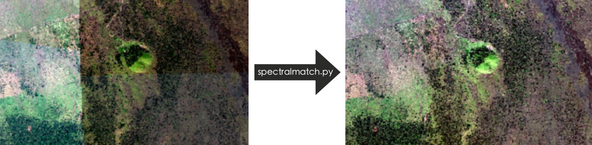
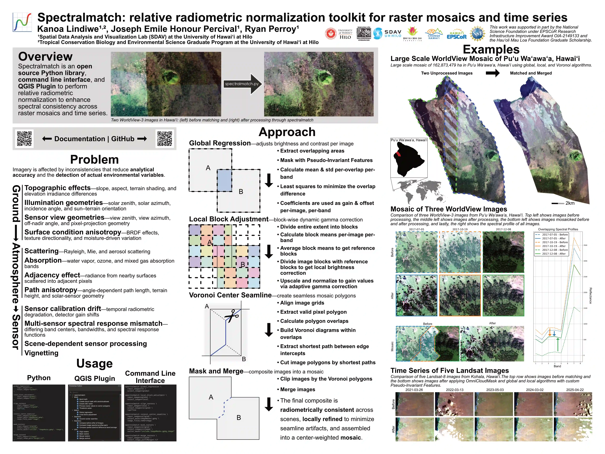

# spectralmatch: relative radiometric normalization toolkit for raster mosaics and time series

[](https://pypi.org/project/spectralmatch/)
[](https://plugins.qgis.org/plugins/spectralmatch_qgis/)
[](#)
[](https://codecov.io/gh/spectralmatch/spectralmatch)
[](https://ssh.cloud.google.com/cloudshell/editor?cloudshell_git_repo=https://github.com/spectralmatch/spectralmatch&cloudshell_working_dir=.)
[](https://spectralmatch.github.io/spectralmatch/llm_prompt)
[](https://doi.org/10.5281/zenodo.15312878)
[](https://doi.org/10.21105/joss.08974)

## Overview



Spectralmatch provides algorithms to perform relative radiometric normalization (RRN) to enhance spectral consistency across raster mosaics and time series. It is built for geoscientific use, with a sensor- and unit-agnostic design, optimized for automation and efficiency on arbitrarily many images and bands, and works well with Very High Resolution Imagery (VHRI) as it does not require pixel co-registration. In addition to matching algorithms, the software supports cloud and vegetation masking, pseudo invariant feature (PIF) based exclusion, seamline network generation, raster merging, and plotting statistics. The toolkit is available as an open-source Python library, command line interface, and QGIS plugin.

> Please cite as: Lindiwe et al., (2026). Spectralmatch: relative radiometric normalization toolkit for raster mosaics and time series. Journal of Open Source Software, 11(117), 8974, https://doi.org/10.21105/joss.08974

## Features

- **Automated, Efficient, and Scalable:** Designed for large-scale workflows with no manual steps, leveraging multiprocessing and Cloud Optimized GeoTIFF support for fast, efficient processing across images, windows, and bands. 

- **Resumable Processing:** Save image stats and block maps for quicker reprocessing.

- **Integrated Seamline and Cloud Masking:** Generate seamlines and detect clouds within the same workflow.

- **Specify Model Images** Include all or specified images in the matching solution to bring all images to a central tendency or selected images spectral profile.

- **Consistent Multi-image Analysis:** Performs minimal necessary adjustments to achieve inter-image consistency while preserving the original spectral characteristics.

- **Sensor and Unit Agnostic:** Supports optical imagery from handheld cameras, drones, crewed aircraft, and satellites for reliable single sensor and multi-sensor analysis, while preserving spectral integrity across all pixel units—including negative values and reflectance.

- **Enhanced Imagery:** Helpful when performing mosaics and time series analysis by blending large image collections and normalizing them over time, providing consistent, high-quality data for machine learning and other analytical tasks.

- **Open Source and Collaborative:** Free under the MIT License with a modular design that supports community contributions and easy development of new features and workflows. Accessible through a python library, command line interface, and QGIS plugin.



---

## Current Matching Algorithms

### Global to local matching
This technique is derived from 'An auto-adapting global-to-local color balancing method for optical imagery mosaic' by Yu et al., 2017 (DOI: 10.1016/j.isprsjprs.2017.08.002). It is particularly useful for very high-resolution imagery (satellite or otherwise) and works in a two phase process.
First, this method applies least squares regression to estimate scale and offset parameters that align the histograms of all images toward a shared spectral center. This is achieved by constructing a global model based on the overlapping areas of adjacent images, where the spectral relationships are defined. This global model ensures that each image conforms to a consistent radiometric baseline while preserving overall color fidelity.
However, global correction alone cannot capture intra-image variability so a second local adjustment phase is performed. The overlap areas are divided into smaller blocks, and each block’s mean is used to fine-tune the color correction. This block-wise tuning helps maintain local contrast and reduces visible seams, resulting in seamless and spectrally consistent mosaics with minimal distortion.


#### Assumptions

- **Consistent Spectral Profile:** The true spectral response of overlapping areas remains the same throughout the images.

- **Least Squares Modeling:** A least squares approach can effectively model and fit all images' spectral profiles.

- **Scale and Offset Adjustment:** Applying scale and offset corrections can effectively harmonize images.

- **Minimized Color Differences:** The best color correction is achieved when color differences are minimized.

- **Geometric Alignment:** Images are assumed to be geometrically aligned with known relative positions via a geotransform. However, they only need to be roughly aligned as pixel co-registration is not required.

- **Global Consistency:** Overlapping color differences are consistent across the entire image.

- **Local Adjustments:** Block-level color differences result from the global application of adjustments.

---
## Installation

> For additional installation instructions see the [Installation Methods](https://spectralmatch.github.io/spectralmatch/installation/) in the docs.

### Installation as a QGIS Plugin
In the [QGIS](https://qgis.org/download/) plugin manager, install 'spectralmatch' and find it in the Processing Toolbox.

### Installation as a Python Library and CLI

Ensure you have the following system-level prerequisites: `Python ≥ 3.10 and ≤ 3.12`, `pip`, `PROJ ≥ 9.3`, and `GDAL ≥ 3.11`; then use pip to install the library:


```bash
conda create -n spectralmatch python=3.12 "gdal>=3.11" "proj>=9.3" -c conda-forge
conda activate spectralmatch
pip install spectralmatch
```

---

## Usage

Example scripts and sample data are provided to verify a successful installation and help you get started quickly in the repository at [`/docs/examples`](https://github.com/spectralmatch/spectralmatch/blob/main/docs/examples/) and downloadable [here](https://download-directory.github.io/?url=https://github.com/spectralmatch/spectralmatch/tree/main/docs/examples&filename=spectralmatch_examples).

This is an example mosaic workflow using folders for each step:


```python
import os
from spectralmatch import *

working_directory = "/path/to/working/directory"
input_folder = os.path.join(working_directory, "Input")
global_folder = os.path.join(working_directory, "GlobalMatch")
local_folder = os.path.join(working_directory, "LocalMatch")
aligned_folder = os.path.join(working_directory, "Aligned")
clipped_folder = os.path.join(working_directory, "Clipped")

global_regression(
    input_images=input_folder,
    output_images=global_folder,
)

local_block_adjustment(
    input_images=global_folder,
    output_images=local_folder,
)

align_rasters(
    input_images=local_folder,
    output_images=aligned_folder,
    tap=True,
)

voronoi_center_seamline(
    input_images=aligned_folder,
    output_mask=os.path.join(working_directory, "ImageMasks.gpkg"),
    image_field_name="image",
)

mask_rasters(
    input_images=aligned_folder,
    output_images=clipped_folder,
    vector_mask=("include", os.path.join(working_directory, "ImageMasks.gpkg"), "image"),
)

merge_rasters(
    input_images=clipped_folder,
    output_image_path=os.path.join(working_directory, "MergedImage.tif"),
)
```

---

## Documentation

Documentation is available at [spectralmatch.github.io/spectralmatch/](https://spectralmatch.github.io/spectralmatch/).

---
## Contributing Guide

Contributing Guide is available at [spectralmatch.github.io/spectralmatch/contributing](https://spectralmatch.github.io/spectralmatch/contributing/).

---

## License

This project is licensed under the MIT License. See [LICENSE](https://github.com/spectralmatch/spectralmatch/blob/main/LICENSE) for details.

## Project Support
This library was developed at the [Spatial Data Analysis and Visualization Lab (SDAV)](https://hilo.hawaii.edu/sdav/) at the University of Hawaii at Hilo by Kanoa Lindiwe. Funding was partly provided by the [Hau‘oli Mau Loa Foundation](https://www.hauolimauloa.org/), in addition to the National Science Foundation EPSCoR grant 2149133, Change Hawaiʻi: Harnessing the Data Revolution for Island Resilience.